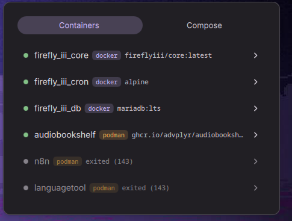

# Gantry

> Gantry is a fork of [DmsDockerManager](https://github.com/LuckShiba/DmsDockerManager)
> by LuckShiba, extended with multi-runtime support. Licensed under GPL-3.0.



Container monitoring and management plugin for [DankMaterialShell](https://danklinux.com/),
built on [DmsDockerManager](https://github.com/LuckShiba/DmsDockerManager) and taking
interface cues from [containerManager](https://github.com/distsystem/dms-plugins/tree/main/containerManager).

Gantry watches **Docker and Podman at the same time**. Containers from both show up
in one list, sorted by state rather than grouped by runtime, and every action is
routed back to the runtime the container actually belongs to. If one runtime is
down, the other keeps working.

## Features

- Watches every enabled runtime at once — one unified, sorted container list
- Runtime badges, shown only when more than one runtime is up
- Compose view; projects with the same name in different runtimes stay separate
- Container detail sheet: uptime, health, restarts, ports, mounts, networks, pod
- Start, restart, pause, unpause and stop, with the result reported back
- Interactive shell and log tailing in your terminal
- Per-runtime event listeners, so one runtime dying does not stop the other
- Full keyboard navigation

## Installation

### Using DMS cli

```sh
dms plugins install gantry
```

### Using DMS Settings

1. Open Settings -> Plugins
2. Click in "Browse"
3. Enable third party plugins
4. Install and enable Gantry
5. Add "Gantry" to your DankBar widgets list

### Manual

1. Copy plugin directory to `~/.config/DankMaterialShell/plugins/gantry`
```sh
git clone https://github.com/jeffersonrto/Gantry ~/.config/DankMaterialShell/plugins/gantry
```
2. Open Settings -> Plugins and click in "Scan"
3. Enable "Gantry"
4. Add "Gantry" to your DankBar widgets list

## Requirements

At least one container runtime, reachable from the shell's environment. Both are
optional and independent — enable only what you use.

**Docker**

- The `docker` CLI on `PATH`, and a reachable daemon.
- Your user must be able to talk to the daemon without `sudo`: either in the
  `docker` group, or running Docker in rootless mode.
- Check with `docker info`. If that works in a terminal, it works in Gantry.

**Podman**

- The `podman` CLI on `PATH`. No daemon required.
- Nothing to configure for rootless use — it is the default.
- Check with `podman info`.

Gantry itself runs `<binary> info` for each enabled runtime on startup and marks
anything that fails as unavailable, so a missing runtime costs you a greyed-out
state, never an error loop.

Optional: `systemd-run` (from systemd). When present, container actions are
launched inside a transient user scope, so they survive a shell restart.

### Podman rootless vs rootful

They are two separate container stores. `podman ps` as your user and
`sudo podman ps` list **different containers**, with separate images, volumes and
networks.

Gantry runs the binary as your user, so it shows the **rootless** set. Containers
you created with `sudo podman` will not appear.

There is currently no way to watch both at once: the runtime list identifies each
entry by id, and there is no UI for adding a third entry. If you need the rootful
set instead, point the Podman binary at a wrapper that elevates — and be aware
that it will need to do so without an interactive password prompt.

## Configuration

Settings live in Settings -> Plugins -> Gantry.

### Container runtimes

The main setting is a list, one row per runtime, each with a toggle and a binary
path:

| Runtime | Enabled by default | Binary |
| --- | --- | --- |
| Docker | yes | `docker` |
| Podman | yes | `podman` |

- **Toggle** — whether Gantry watches that runtime at all. A disabled runtime is
  never queried, never listed, and refuses any action aimed at it.
- **Binary** — the executable to run. A bare name is resolved on `PATH`; an
  absolute path works too. It takes no arguments: to add flags (say,
  `podman --remote`), point it at a small wrapper script.

Turn off what you do not use. With a single runtime enabled, the runtime badges
disappear from the list — they would be noise.

### Other settings

- **Debounce Delay** — how long to wait after a container event before refreshing,
  so a burst of changes causes one refresh instead of many (default: `300ms`).
- **Background Polling Interval** — fallback refresh for when event-based updates
  are unreliable. `0` disables it (default: `0ms`).
- **Terminal Application** — command used to open a terminal for shell and logs
  (default: `alacritty --hold`). Gantry appends `-e <command>` itself, so leave
  `-e` out of this setting. Examples: `alacritty --hold`,
  `ghostty --wait-after-command`, `kitty --hold`, `foot --hold`.
- **Shell Path** — path of the shell to run inside containers, without
  arguments. Many images only ship `/bin/sh` (default: `/bin/sh`).

## Usage

The bar shows the plugin icon and the number of running containers across every
enabled runtime. With nothing running, or no runtime available, the icon dims and
the count disappears.

Clicking it opens a popup with three levels:

1. **Containers** or **Compose**, chosen with the toggle at the top.
2. A **project sheet**, from the Compose list: project-wide actions plus its
   services.
3. A **container sheet**, from either list: state, metadata and per-container
   actions.

Actions offered depend on the container's state — a stopped container has no
Stop, a container that is not running has no Shell. Results arrive as a toast at
the bottom of the popup; on failure it carries the runtime's own message.

When one runtime is down and another is up, a banner names the missing one and
the list carries on with what is left. When none respond, the popup says so.

### Keyboard Navigation

| Key | Action |
| --- | --- |
| `↑` `↓`, `Ctrl+K/J`, `Ctrl+P/N` | Move through the current list |
| `→` or `Enter` | Open the selected item |
| `←` | Go back one level |
| `Tab` | In a project sheet, switch between actions and services |
| `V` | Switch between Containers and Compose (top level only) |
| `Esc` | Close the popup |

## Credits

Gantry draws on two plugins that solve this problem for DankMaterialShell:

- [DmsDockerManager](https://github.com/LuckShiba/DmsDockerManager) by LuckShiba —
  the project Gantry is forked from, and the base of its service, widget and
  keyboard navigation design.
- [containerManager](https://github.com/distsystem/dms-plugins/tree/main/containerManager)
  by distsystem — an independent take on multi-runtime container management, used
  as a reference for the interface.

Both are worth a look if Gantry is not what you are after.

The original plugin was itself inspired by the GNOME extension
[Easy Docker Containers](https://extensions.gnome.org/extension/2224/easy-docker-containers/).

## License

GPL-3.0, inherited from [DmsDockerManager](https://github.com/LuckShiba/DmsDockerManager).
See [LICENSE](./LICENSE).
